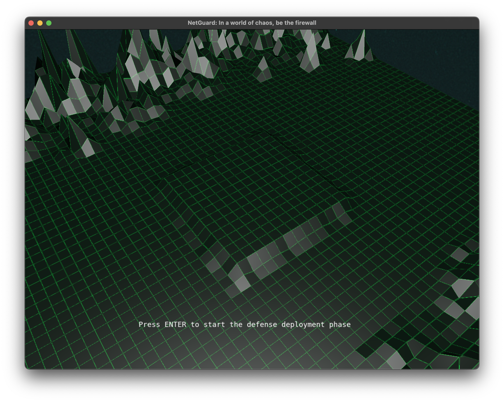

# NetGuard: In a World of Chaos, Be the Firewall


[](README.md)
## Description

**NetGuard** is a 3D game developed as the final project for the **Computer Graphics Fundamentals (INF01047)** course, taught by Prof. Eduardo Gastal at the Federal University of Rio Grande do Sul (UFRGS).

The goal of the game is to defend a base — representing a server — against a series of cyberattacks. The player controls the placement of defense towers, which symbolize cybersecurity protection methods, and must prevent enemies, portrayed as invaders, from reaching the server. The game simulates a cyber defense scenario where the player must strategically place defenses to survive waves of attacks. This gamified approach aims to teach cybersecurity concepts in an interactive and engaging way, allowing players to understand the importance of network defense while having fun.

While developing NetGuard, we applied fundamental computer graphics concepts such as 3D rendering, texture handling, and lighting to create a visually immersive experience. The game uses the **OpenGL** library for graphical rendering, enabling the creation of dynamic and interactive 3D environments.

> \[!IMPORTANT]
> The game is not fully complete, but it's already playable and provides a solid foundation for future improvements and expansions. We're actively working on adding more features and polishing the overall gameplay experience.

## Demo




## User Guide

The game is controlled via keyboard and mouse, using the following instructions:

* **Onboarding Phase**: This is the game's intro screen. Press `Enter` to begin.
* **Defense Deployment Phase**: During this phase, the player can place defense towers by clicking the `left mouse button` on available positions on the map. Towers can be strategically placed to maximize defense coverage.
* **Invasion Phase**: Once towers are placed, the player must press `Enter` to initiate the invasion phase. During this phase, enemies will begin to attack the base, and the player can observe how the towers respond. Camera movement is done via:

  * `W` and `S`: Move the camera forward and backward.
  * `A` and `D`: Move the camera sideways.
  * `Q` and `E`: Move the camera up and down.

## Applied Computer Graphics Concepts

Throughout NetGuard’s development, we implemented several core computer graphics concepts covered in the course. Highlights include:

* **Mathematical Foundations**: Use of linear algebra for manipulating vectors and matrices, essential for geometric transformations, camera movement, and lighting calculations.
* **Geometric Transformations**: Translation, rotation, and scaling operations are applied directly within object draw methods to ensure proper scene positioning.
* **Polygon Meshes**: We use `tinyobjloader` to load `.obj` files with support for vertices, normals, and texture coordinates. Models include enemies, towers, the environment, and other scene elements.
* **Graphics Pipeline**: We implemented a programmable pipeline using GLSL shaders, adapted from course labs. Lighting and texturing systems are controlled by these custom shaders.
* **Shaders and Lighting Models**: Objects support flexible shading models — Phong or Gouraud — with Blinn-Phong lighting implemented, including ambient, diffuse, and specular components. A single directional light source is used. Texture mapping uses coordinates loaded from `.obj` files.
* **Animations**: The camera features orbital animations that circle the base, giving players a dynamic scene overview. Cubic Bézier curves are used to smoothly transition between look-at and top-down camera modes. Linear movement toward target points is also implemented for enemy motion.
* **Cameras**: Three camera modes were developed: free camera (direct player control), look-at camera (scripted movement), and top-down camera (static overhead view, ideal for tower placement).
* **Collision Detection**: In `collisions.hpp`, we implemented ray-plane, ray-triangle, AABB, sphere-box, and sphere-sphere collision techniques. These functions offer flexibility and serve as a base for future gameplay mechanics, although not all are currently used.

## Development Process

Development followed an incremental approach, with features added as needed. First, the game concept was defined based on course requirements. Next, we refactored the base code for modularity and maintainability. Then, key classes and abstractions were created, such as the camera, scene objects, and a basic game manager. Core features like lighting, mesh rendering, enemy logic, tower placement, and collision detection were added afterward.

### Team Contributions

This project was developed collaboratively, with the following main contributions:

* **Adriel de Souza ([@dsadriel](https://github.com/dsadriel))**:

  * Game logic implementation, including state machine for game phases, enemy movement, and tower placement.
  * Camera system, including look-at and top-down modes.
  * Collision detection and picking system.
  * Abstraction of scene objects, including drawing and update methods.
  * Time-based animation system for camera and enemy movement.

* **Nicolas Chin Lee ([@nicolasclee](https://github.com/nicolasclee))**:

  * Lighting model implementation (Lambert and Blinn-Phong).
  * Shading model implementation (Phong and Gouraud) for units and terrain.
  * Bézier curve system for onboarding-to-deployment camera transitions.
  * Camera-to-map collision using bounding spheres and boxes.
  * Base code refactor for modularity and development quality.

### Use of AI Tools

AI tools were used for asset generation (textures and 3D models) and development assistance. AI also contributed to documentation, project organization, and debugging. Tools included:

* **GitHub Copilot** (GPT-4.1 & Claude Sonnet 4): Assisted with code writing, suggestions, documentation, and bug fixing.
* **ChatGPT** (various models): Helped resolve technical issues, clarify concepts, and debug problems.
* **Meshy**: Generated 3D assets like tower and enemy models.

These tools accelerated development, particularly in graphics-related tasks. However, generated code/assets often required manual adjustments to meet project requirements. In more complex cases, AI produced vague or incorrect solutions, demanding manual intervention.

## Build and Run Instructions

### Prerequisites

* A modern C++ compiler (g++, Clang, etc.)
* **CMake** (version 3.10+)
* **Make**
* **Git** (to clone the repository)

### Build & Run

1. **Clone the repository:**

   ```bash
   git clone git@github.com:dsadriel/NetGuard.git
   cd NetGuard
   ```

2. **Compile and run:**

   On macOS, Linux, or Windows (via terminal), run:

   ```bash
   mkdir build
   cd build
   cmake ..
   make
   make run
   ```

   These commands will create a `build` folder, generate build files with CMake, compile the project, and launch the game.
