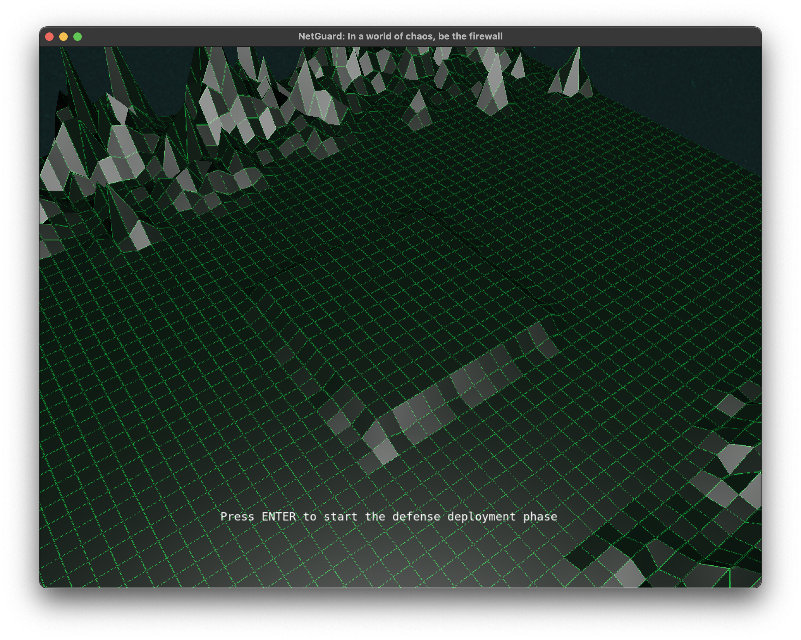
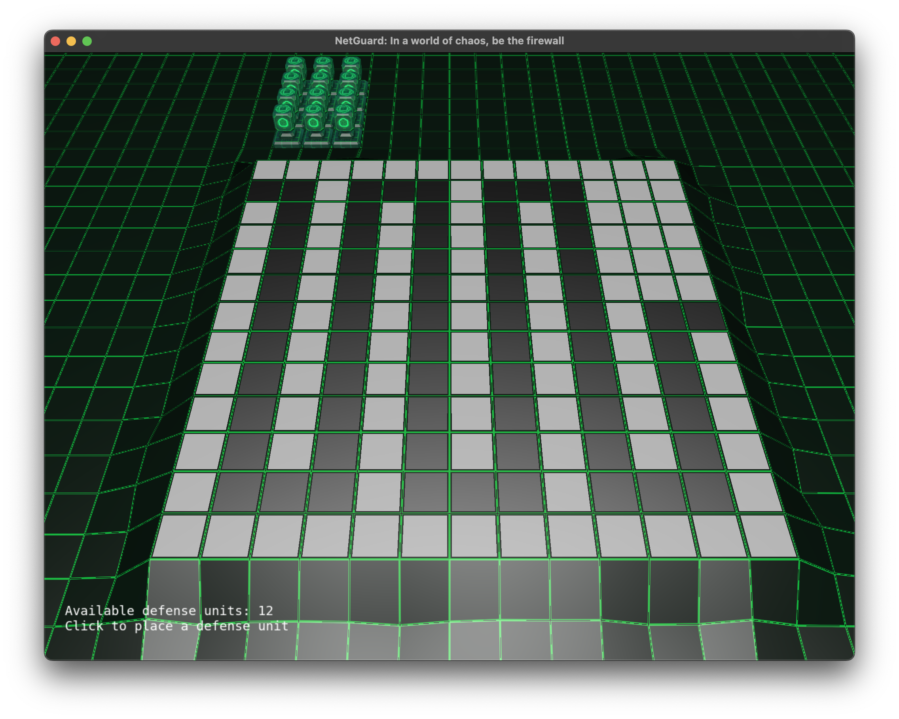
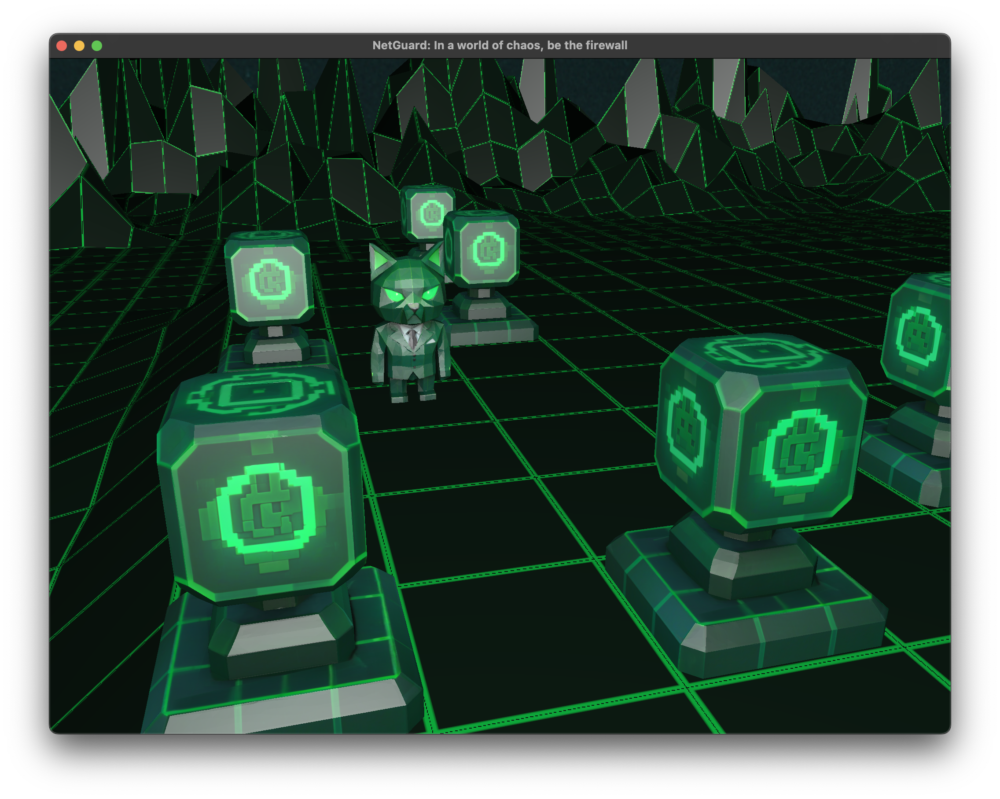

# NetGuard: In a world of chaos, be the firewall


## Descrição

**NetGuard** é um jogo 3D desenvolvido como trabalho final para a disciplina de **Fundamentos de Computação Gráfica (INF01047)**, ministrada pelo Prof. Eduardo Gastal na Universidade Federal do Rio Grande do Sul (UFRGS).

O objetivo do jogo é defender uma base, que representa um servidor, de uma série de ataques cibernéticos. O jogador controla a colocação de torres de defesa, que representam métodos de proteção contra invasões, e deve impedir que os inimigos, representados por invasores, cheguem até a base. O jogo é uma simulação de um cenário de defesa cibernética, onde o jogador deve usar estratégia e posicionamento para vencer as ondas de ataque. Essa abordagem lúdica visa ensinar conceitos de segurança cibernética de forma interativa e envolvente, permitindo que os jogadores aprendam sobre a importância da defesa em rede enquanto se divertem.

Ao desenvolver o NetGuard, buscamos aplicar conceitos fundamentais de computação gráfica, como renderização 3D, manipulação de texturas e iluminação, para criar uma experiência visualmente atraente e imersiva. O jogo utiliza a biblioteca **OpenGL** para renderização gráfica, permitindo a criação de ambientes tridimensionais dinâmicos e interativos.

> [!IMPORTANT]  
> O jogo ainda não está totalmente pronto, mas já é jogável e apresenta uma boa base para futuras melhorias e expansões. Estamos trabalhando para adicionar mais recursos e polir a experiência de jogo.

## Demonstração





## Manual de Utilização

O jogo é controlado por meio de um teclado e mouse, seguindo as seguintes instruções:

- **Fase de embarque**: Esta fase é a apresentação do jogo, para iniciar o jogo basta pressionar a tecla `Enter`

- **Fase de coloção de defesas**: Nesta fase, o jogador pode posicionar torres de defesa clicando com o `botão esquerdo do mouse` sobre as posições disponíveis no mapa. As torres podem ser colocadas em locais estratégicos para maximizar a defesa contra os inimigos.

- **Fase de invasão**: Após posicionar as torres, o jogador deve pressionar a tecla `Enter` para iniciar a fase de invasão. Nesta fase, os inimigos começarão a atacar a base, e o jogador deve observar como as torres se comportam e defendem a base. Para movimentar a câmera, utilize as seguintes teclas:

  - `W` e `S`: movimentam a câmera para frente e para trás, respectivamente.
  - `A` e `D`: movimentam a câmera para os lados.
  - `Q` e `E`: movimentam a câmera para cima e para baixo.


## Conceitos de Computação Gráfica Aplicados

Durante o desenvolvimento do NetGuard, tivemos a oportunidade de aplicar diversos conceitos fundamentais de computação gráfica vistos na disciplina. Abaixo estão os principais conceitos implementados no projeto:

- **Conceitos matemáticos**: Utilização de álgebra linear para manipulação de vetores e matrizes, essenciais para transformações geométricas, movimentação de câmera e cálculos de iluminação.
- **Transformações geométricas**: Implementamos operações de translação, rotação e escala, compostas diretamente nos métodos de desenho dos objetos para garantir o posicionamento correto na cena.
- **Malhas poligonais**: Utilizamos o `tinyobjloader` para carregar arquivos `.obj`, com suporte a vértices, normais e coordenadas de textura. Os modelos representam inimigos, torres, cenário e outros elementos do jogo.
- **Pipeline gráfico**: Utilizamos pipeline programável com shaders escritos em GLSL, adaptados a partir dos laboratórios da disciplina. Todo o sistema de iluminação e texturização é controlado por esses shaders personalizados.
- **Shaders e modelos de iluminação**: Os shaders e modelos de iluminação foram implementados com flexibilidade para cada objeto, que possui seu próprio modelo de interpolação, seja Phong ou Gouraud. Adotamos o modelo de iluminação Blinn-Phong, contemplando os componentes ambiente, difusa e especular. A cena conta com uma única fonte de luz configurada de forma direcional. O mapeamento de texturas utiliza coordenadas carregadas diretamente dos arquivos .obj.
- **Animações**: A câmera possui animações orbitais que promovem um movimento circular em torno da base, permitindo uma apresentação dinâmica do ambiente para o jogador. Utilizamos curvas Bézier cúbicas especificamente para controlar a transição suave entre a câmera look-at e a câmera top-down Além disso, implementamos movimentação linear em direção a pontos-alvo, utilizada tanto para a movimentação dos inimigos.
- **Câmeras**: Quanto às câmeras, foram desenvolvidos três modos distintos. A câmera livre permite controle direto pelo jogador. A câmera do tipo look-at apresenta movimentos programados, oferecendo uma visão dirigida. Por fim, a câmera top-down proporciona uma visão fixa, ideal para estratégias de posicionamento no jogo.
- **Testes de colisão**: No arquivo `collisions.hpp`, implementamos várias técnicas de detecção, incluindo interseção entre raios e planos, raios e triângulos, colisões entre caixas alinhadas aos eixos (AABB), esferas com caixas e entre esferas. Essas funções foram desenvolvidas para oferecer flexibilidade no projeto, mas no momento nem todas estão efetivamente utilizadas na lógica do jogo, servindo como base para expansões e experimentos futuros.


## Processo de Desenvolvimento

O desenvolvimento ocorreu de forma incremental, com etapas definidas conforme surgiam as demandas do projeto. Primeiro, foi definida a proposta do jogo em alinhamento com os requisitos da disciplina. Em seguida, foi realizada a refatoração do código base para garantir uma estrutura mais modular e organizada, facilitando futuras melhorias. Depois, foram criadas as principais abstrações em classes, como a implementação da câmera, o aprimoramento dos objetos de cena e um gerenciador básico do jogo. A partir daí, foi realizada a implementação das funcionalidades principais: modelos de iluminação, carregamento e renderização de malhas poligonais, e por fim a lógica do jogo, incluindo a movimentação dos inimigos, o posicionamento das torres e a detecção de colisões.


### Contribuições da Dupla

O trabalho foi desenvolvido em colaboração, com as seguintes contribuições principais:

- **Adriel de Souza ([@dsadriel](https://github.com/dsadriel))**: 
    - Implementação da lógica de jogo, incluindo maquina de estados para gerenciar as fases do jogo, movimentação dos inimigos e posicionamento das torres.
    - Desenvolvimento da câmera, incluindo os modos de câmera look-at e top-down.
    - Criação do sistema de detecção de colisões e picking.
    - Aprimoramento da abstração de objetos de cena, incluindo a texturização e estilos de objetos.
    - Abastrção de diversas classes, incluindo métodos de desenho e atualização de objetos.
    - Animação baseada em tempo, para movimentação da camera e inimigos.
- **Nicolas Chin Lee ([@nicolasclee](https://github.com/nicolasclee))**:
    > TODO


### Análise do Uso de Ferramentas de IA

Foram empregadas ferramentas de IA para geração de assets, como texturas e modelos 3D, além de otimizar etapas do desenvolvimento. A IA também contribuiu na geração parcial da documentação, organização do projeto e na resolução de problemas técnicos, bugs e erros. As ferramentas utilizadas foram:

- **GitHub Copilot** (GPT-4.1 e Claude Sonnet 4): suporte à escrita de código, sugestões de melhorias, documentação e resolução de problemas/bugs.
- **ChatGPT** (diversos modelos): esclarecimento de dúvidas pontuais, suporte na resolução de problemas técnicos, bugs e erros.
- **Meshy**: criação de assets 3D, incluindo modelos de torres e inimigos.

No geral, as ferramentas aceleraram o desenvolvimento, especialmente no aspecto de computação gráfica. Contudo, geraram código e assets que nem sempre estavam alinhados às especificações, demandando ajustes manuais. Em problemas mais complexos, a IA falhou em oferecer soluções úteis, produzindo respostas vagas, imprecisas ou equivocadas, o que exigiu intervenção detalhada.

## Como Compilar e Executar

### Pré-requisitos

  * Um compilador C++ moderno (g++, Clang, etc.)
  * **CMake** (versão 3.10 ou superior)
  * **Make**
  * **Git** para clonar o repositório

### Passos para Execução

1.  **Clone o repositório:**

    ```bash
    git clone git@github.com:dsadriel/NetGuard.git
    cd NetGuard
    ```

2.  **Execute o script de compilação e execução:**

    No macOS, Linux ou Windows (via terminal), siga os passos abaixo para compilar e executar o projeto manualmente:

    ```bash
    mkdir build
    cd build
    cmake ..
    make
    make run
    ```

    Esses comandos irão criar a pasta `build`, gerar os arquivos de build com o CMake, compilar o projeto e executar o jogo.
